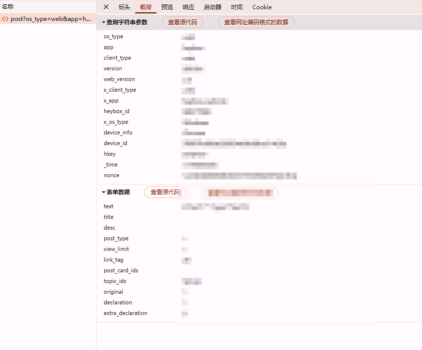
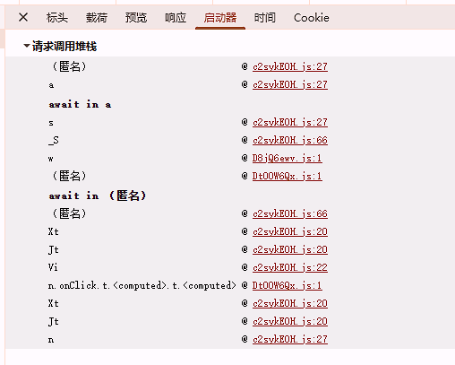
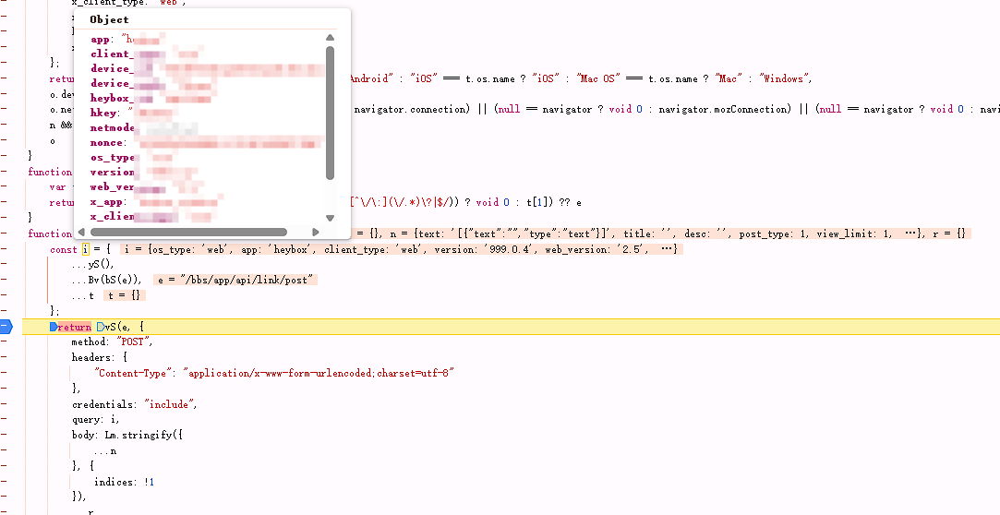
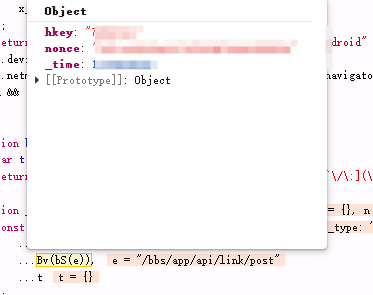
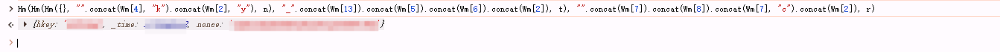

# 前言

:::caution
请务必阅读前言
:::

[小黑盒](https://www.xiaoheihe.cn/app/bbs/home)作为国内游戏社区，是我个人比较喜欢的社区之一了。

为了社区的良好环境，请不要滥用接口！也请看这篇文章的黑产灰产之类的可以放弃想法。

# 过程

任意打开一个页面，将控制台切换为网络，过滤条件为Fetch/XHR。

打开任意一个数据请求，查看其载荷。这里使用发布文章示例。



可以看到，在查询字符串参数中，有两个参数是引人注目的：

**hkey** 和 **nonce**

打开启动器：



查看调用堆栈，最下方的为最开始的地方。

通过断点调试，可以得出，在_S堆栈中，构造了请求内容。



再经过细致调试，不难看出，在`Bv(bS(e))`这个函数嵌套调用中，Bv返回的内容为hkey与nonce。



查看Bv函数

```js
function vv(e) {
    var t, n, r, i = Wm[3];
    return t = ~~(+lv.w() / 1e3),
    r = (0,
    Jm.MD5)(t + Math.random((new Date).getTime()).toString()).toString().toLocaleUpperCase(),
    n = lv[i](e, t, r),
    Hm(Hm(Hm({}, "".concat(Wm[4], "k").concat(Wm[2], "y"), n), "_".concat(Wm[13]).concat(Wm[5]).concat(Wm[6]).concat(Wm[2]), t), "".concat(Wm[7]).concat(Wm[8]).concat(Wm[7], "c").concat(Wm[2]), r)
}
```

这里是混淆比较复杂的一点，如果你直接搜索hkey是没有结果的，因为hkey为函数最后拼接的字符串。



控制台调试也可以发现。

而三个参数分别对应的是n,t,r（苦也，这也有牛）


仔细观察上方混淆后的代码，不难看出：

## t ( \_time)

t的获取是简单的，t = \~~(+lv.w() / 1e3)

其中lv.w()查看可以得到以下函数：

```js
function() {
        return new Date
    }
```

仅为获取时间，然后除以1e3(1000)。这就是十位时间戳。

## r (nonce)

r在混淆中也能看出来，其为时间+通过时间戳获取的字符串再转换为md5，类似于随机数吧！

## n(hkey)

n的获取是最难的，在混淆中，其赋值过程为`n = lv[i](e, t, r)`

lv[i]是什么函数？

```js
    i: function(e, t, n) {
        return ov(e, t + 3, n)
    },
```

ov又是什么函数？


```js
function ov(e, t, n) {
    e = "/".concat(e.split("/").filter(function(e) {
        return e
    }).join("/"), "/");
    var r = "AB45STUVWZEFGJ6CH01D237IXYPQRKLMN89"
      , i = function(e) {
        for (var t = "", n = function(n) {
            e.forEach(function(e) {
                n < e.length && (t += e[n])
            })
        }, r = 0; r < Math.max.apply(Math, iv(e.map(function(e) {
            return e.length
        }))); r++)
            n(r);
        return t
    }([av(String(t), r, -2), sv(e, r), sv(n, r)]).slice(0, 20)
      , o = (0,
    Jm.MD5)(i).toString()
      , a = "".concat(Km(o.slice(-6).split("").map(function(e) {
        return e.charCodeAt()
    })).reduce(function(e, t) {
        return e + t
    }, 0) % 100);
    a = a.length < 2 ? "0".concat(a) : a;
    var s = av(o.substring(0, 5), r, -4);
    return "".concat(s).concat(a)
}
```

到这里，这个函数又引出了其他函数，而其他函数又引出了其他函数，都是为了混淆加密。

通过函数调用链我们只需要将其搬运过来即可。

ov函数主要获取三个参数：

e,t,n

e：

请求目录，例如，在发送的请求中，除去查询内容，请求url为`https://api.xiaoheihe.cn/bbs/app/api/link/post`
则e就为`/bbs/app/api/link/post`

t：

10位时间戳（秒）

n：

nonce

首先获取到e后，先规范目录格式化：

```js
    e = "/".concat(e.split("/").filter(function(e) {
        return e
    }).join("/"), "/");
```

然后定义一个固定的字符串

```js
var r = "AB45STUVWZEFGJ6CH01D237IXYPQRKLMN89"
```

再通过av，sv函数共获取包含三个字符串的数组

```js
[av(String(t), r, -2), sv(e, r), sv(n, r)]
```

将数组按照最短在前排序后，按顺序合成一个新的字符串。

例如数组如下：

["三个字","四个字啊","五个字哦哟"]

合成的新字符串如下：

`三四五个个个字字字啊哦哟`

就是所有数组的第n位按照顺序+=新的字符串，依次类推

然后截取前20位获取MD5。

再获取后六位md5，转换为数组，将其转换为ascii码相加。

再通过Km混淆函数混淆：

这函数诗人想出来的啊？

```js
function Km(e) {

  var t = [0, 0, 0, 0];

  return (

    (t[0] = Gm(e[0]) ^ Ym(e[1]) ^ $m(e[2]) ^ qm(e[3])),

    (t[1] = qm(e[0]) ^ Gm(e[1]) ^ Ym(e[2]) ^ $m(e[3])),

    (t[2] = $m(e[0]) ^ qm(e[1]) ^ Gm(e[2]) ^ Ym(e[3])),

    (t[3] = Ym(e[0]) ^ $m(e[1]) ^ qm(e[2]) ^ Gm(e[3])),

    (e[0] = t[0]),

    (e[1] = t[1]),

    (e[2] = t[2]),

    (e[3] = t[3]),

    e

  );

}
```

然后将所有数字相加，获得最后两位数，不足补齐0，获得a

然后通过av函数获得s，将s和a拼接为字符串及可获取hkey

```js
a = a.length < 2 ? "0".concat(a) : a;
    var s = av(o.substring(0, 5), r, -4);
```


# 简化文件

运行环境为nodejs

```js
const crypto = require("crypto");

const time = Math.floor(Date.now() / 1000);

  

function md5(c) {

  return crypto.createHash("md5").update(c).digest("hex");

}

  

function CreateNonce() {

  return md5(

    time + Math.random(new Date().getTime()).toString(),

  ).toLocaleUpperCase();

}

function rv(e, t) {

  (null == t || t > e.length) && (t = e.length);

  for (var n = 0, r = new Array(t); n < t; n++) r[n] = e[n];

  return r;

}

function av(e, t, n) {

  for (var r = "", i = t.slice(0, n), o = 0; o < e.length; o++)

    r += i[e.charCodeAt(o) % i.length];

  return r;

}

function sv(e, t) {

  for (var n = "", r = 0; r < e.length; r++) n += t[e.charCodeAt(r) % t.length];

  return n;

}

  

function CreateNewStr(Str1, Str2, Str3) {

  let str = "";

  let arr = [];

  if (Str1.length < Str2.length) {

    if (Str3.length < Str1.length) {

      arr = [Str3, Str1, Str2];

    }

    if (Str3.length > Str2.length) {

      arr = [Str1, Str2, Str3];

    }

    if (Str3 > Str1 && Str3 < Str2) {

      arr = [Str1, Str3, Str2];

    }

  }

  if (Str2.length < Str1.length) {

    if (Str3.length < Str1.length) {

      arr = [Str3, Str2, Str1];

    }

    if (Str3.length > Str2.length) {

      arr = [Str2, Str1, Str3];

    }

    if (Str3 > Str1 && Str3 < Str2) {

      arr = [Str2, Str3, Str1];

    }

  }

  const theMax = Math.max(Str1.length, Str2.length, Str3.length);

  for (let i = 0; i < theMax; i++) {

    if (arr[0].length < i + 1 && arr[1].length > i) {

      str += arr[1][i];

      str += arr[2][i];

      continue;

    }

  

    if (arr[1].length < i + 1) {

      str += arr[2][i];

      continue;

    }

  

    str += arr[0][i];

    str += arr[1][i];

    str += arr[2][i];

  }

  return str;

}

function Vm(e) {

  return 128 & e ? 255 & ((e << 1) ^ 27) : e << 1;

}

function qm(e) {

  return Vm(e) ^ e;

}

function $m(e) {

  return qm(Vm(e));

}

function Ym(e) {

  return $m(qm(Vm(e)));

}

function Gm(e) {

  return Ym(e) ^ $m(e) ^ qm(e);

}

function Km(e) {

  var t = [0, 0, 0, 0];

  return (

    (t[0] = Gm(e[0]) ^ Ym(e[1]) ^ $m(e[2]) ^ qm(e[3])),

    (t[1] = qm(e[0]) ^ Gm(e[1]) ^ Ym(e[2]) ^ $m(e[3])),

    (t[2] = $m(e[0]) ^ qm(e[1]) ^ Gm(e[2]) ^ Ym(e[3])),

    (t[3] = Ym(e[0]) ^ $m(e[1]) ^ qm(e[2]) ^ Gm(e[3])),

    (e[0] = t[0]),

    (e[1] = t[1]),

    (e[2] = t[2]),

    (e[3] = t[3]),

    e

  );

}

  

function CreateHkey(path, time, nonce) {

  path = "/".concat(

    path

      .split("/")

      .filter(function (e) {

        return e;

      })

      .join("/"),

    "/",

  );

  

  const r = "AB45STUVWZEFGJ6CH01D237IXYPQRKLMN89"

  

  const str1 = av(String(time), r, -2)

  const str2 = sv(path, r);

  const str3 = sv(nonce, r);

  const NewStr = CreateNewStr(str1, str2, str3)

  const strMd5 = md5(NewStr.slice(0, 20))

  

  const last = strMd5.slice(-6).split("")

  const ascil = last.map((c) => c.charCodeAt())

  const mixed = Km(ascil);

  const sum = mixed.reduce((s, n) => s + n, 0)

  const a = (sum % 100).toString().padStart(2, "0")

  const s = av(strMd5.substring(0, 5), r, -4)

  return "".concat(s).concat(a);

}

const nonce = CreateNonce();

const key = CreateHkey("/bbs/app/api/link/post", time, nonce)

  
  

console.log(time, nonce, key)
```

# 注意！

不要滥用！等到官方重视起来的话大家都没得用！！！


# 日后谈

有空写个go的