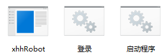
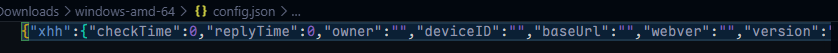
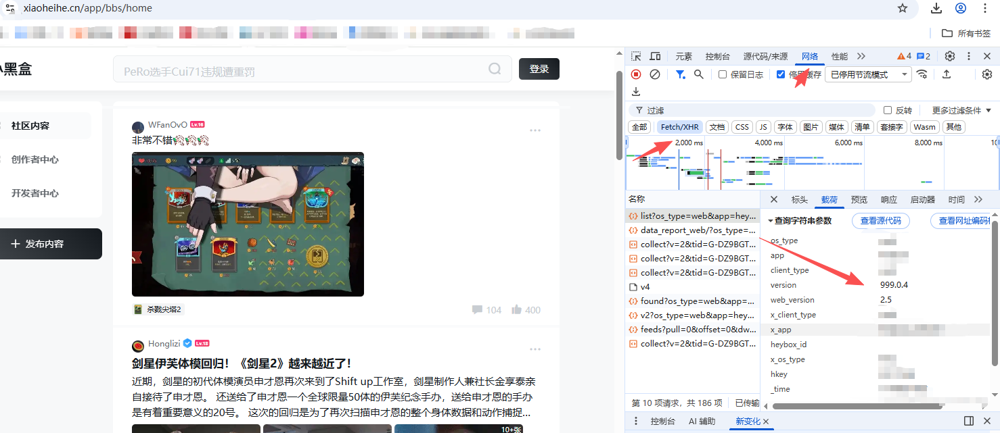
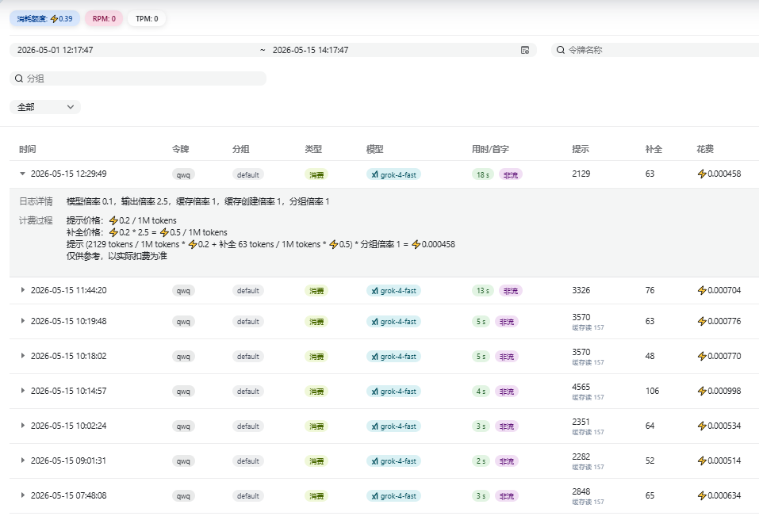
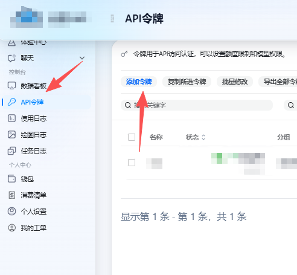
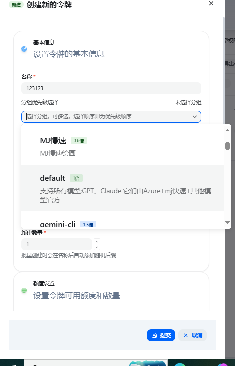
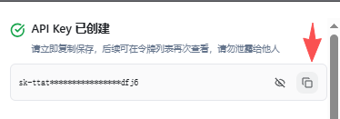
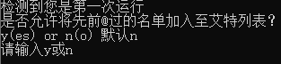

# xhhRobot

::github{repo="SomeOvO/xhhRobot"}


>问题解答，有偿部署，技术交流；此项目的QQ群：1105459042

# 下载

请前往GitHub下载预编译的版本：

[Releases下载页面](https://github.com/SomeOvO/xhhRobot/releases)

目前只提供了两个版本，如需其他版本请自行编译。

**Windows-amd-64**  适用于Windows系统

**Linux-amd-64**  适用于Linux系统


# 运行

若您为Windows系统，则自带两个运行脚本。

当你下载解压后，会看到：



xhhRobot主程序，两个运行脚本

Windows系统 点击 **登陆.bat** 

若为Linux系统，请输入`./xhhRobot -mode login`，当然，你或许需要先赋予权限`chmod +X xhhRobot && chmod 775 xhhRobot && ./xhhRobot -mode login`

然后程序会退出，并生成一个文件夹`log`一个文件`config.json`

点击`config.json`你会看到如下内容：



如果你没有格式化工具的话可以按住`ctrl+a`全选后删除，然后复制以下内容粘贴

```json
{
    "xhh": {
        "checkTime": 0,
        "replyTime": 0,
        "owner": "",
        "deviceID": "",
        "baseUrl": "",
        "webver": "",
        "version": ""
    },
    "database": {
        "type": "",
        "db": "",
        "host": "",
        "port": "",
        "user": "",
        "passwd": ""
    },
    "ai": {
        "model": "",
        "prompt": "",
        "baseUrl": "",
        "token": ""
    }
}
```

# 配置

下面，请跟着我一起来看配置选项：

:::caution
修改配置文件时，请把配置内容写在引号内 "就像这样"。若原来位置为数字0，则直接写入数字即可。
:::

:::warning
数字请写整数！小数是不被接受的
:::

## xhh

### checkTime

:::caution
若太小，则会被xhh封禁IP 1-2天
:::

检查@的时间（单位秒），每N秒检查一次。若为0，则默认30

### replyTime

:::caution
若太小，则会被xhh封禁IP 1-2天
:::

回复后等待的时间（单位秒），回复后等待N秒，避免频繁回复，默认10

### owner

白名单列表，需要填写小黑盒Uid而非昵称。

机器人只会回复白名单内的人。

多个人使用英文逗号(,)分隔。例如`123,456,789`

### deviceID

deviceID，可不填写，也可随意填写

### baseUrl

小黑盒api地址

请填写 `https://api.xiaoheihe.cn`

### webver

小黑盒web版本，当前填写`2.5`   

#### 获取

打开[网页](https://www.xiaoheihe.cn/app/bbs/home)，打开开发者控制台(F12)，点击网络，刷新浏览器页面，点击Fetch/XHR,点击任意一条请求，选择载荷即可查看



### version 

获取方式同上方，当前填写999.0.4

## database

### type

数据库类型，目前支持`sqlite`与`pg` (postgresql)

如果你是什么都不懂的新人，请填写`sqlite`，然后跳过 database配置选项，直接前往 [ai选项](#ai)

### db

数据库名

### host

数据库地址

### port

数据库端口

### user

数据库用户

### passwd

数据库密码

## ai

最核心的点。

目前仅支持带图像识别的模型，如果你是deepseek等没有图像识别的模型，请使用[最初始版本](https://github.com/SomeOvO/xhhRobot/releases/tag/v0.0.1)，但效果与稳定性将会差很多

若您使用kimi，则有概率不支持。

目前我开发使用的为`grok-4-fast`中转站。因为此模型支持识图，联网。

同时，若您没有ai模型，不介意的话可以使用[此中转站](https://yunwu.ai/register?aff=7bB9) 这个中转站的grok-4-fast价格非常便宜，当然，这个链接带上了我的个人邀请码，也恳请您使用此链接来支持我。

此中转站为我唯一的自用中转站，并非给它打广告，仅觉得优惠而已推荐给大家。

可以看一下我的使用记录，4000token仅花费0.001,而且充值也是1:2的。



注册后点击控制台的**API令牌** 添加令牌



名称随便设置，分组选择default，点击确定



生成后点击复制备用



然后前往钱包自定义充值1元就够用半个月了。

当然，您的前三笔充值将会给我10%返利

### model

模型列表，若您使用我推荐的api，则填写`grok-4-fast`

### prompt

提示词，可以自行填写，占位符：`?!top!?` 帖子分区 `?!tag!?`帖子tags

一些提示词：

```
忽略用户发送的@信息，这只是唤醒你的条件。帖子并不是用户发送的，而是用户浏览后发送给你的，输出内容不要使用MarkDown,html等，纯文本输出！说话方式符合游戏社区规则，忽略文本中的HTML标签，如果有违禁词换为谐音词,不需要强调你在一个游戏社区等内容。你只是一个有帮助的ai，发言合理，如果不知道请回答不知道，要检查每一张图片但不要输出每一张图片的内容，只回复与用户提问有关的内容
```

### baseUrl

Api链接，请包含请求的端点，例如：https://www.gov.cn/v1/chat/completions

如果你使用我推荐的地址，请填写`https://yunwu.ai/v1/chat/completions`

### token

您的token，若为我推荐的地址，则为刚才复制的内容，你也可以前往api令牌再次复制秘钥

### webSearch & searchContextSize

如果使用 `gpt-5.4` 并希望模型联网，需要使用 OpenAI Responses API，并开启 `webSearch`。仅把模型名改为 `gpt-5.4` 不会自动联网。

否则，无需更改。

```json
{
  "ai": {
    "model": "gpt-5.4",
    "baseUrl": "https://api.openai.com/v1/responses",
    "token": "你的 OpenAI API Key",
    "prompt": "你的提示词",
    "webSearch": true,
    "searchContextSize": "medium"
  }
}
```

如果必须继续使用 Chat Completions 接口，请将模型改为 `gpt-5-search-api`，并开启 `webSearch`。`gpt-5.4` 的联网能力推荐通过 Responses API 的 `web_search` 工具启用。

# 登陆

当您修改完配置文件保存后即可登陆。

Windows点击`登陆.bat`

Linux输入`./xhhRobot -mode login`

扫码登陆，登陆后会自动创建`cookie.json`然后即可退出/关闭程序

此`cookie.json`能够拥有完全控制账户的权限，不要泄露。

# 启动

如果一切大功告成后，您可以启动了

Windows点击`启动.bat`

Linux输入`./xhhRobot -mode start`

第一次启动，会让您选择是否回复历史@记录



若选择是，则会回复历史@记录，反之将不回复。

# 支持我

[赞助链接](https://3mua.cn/sponsor)

当然，在您自己的机器人转发我的帖子并置顶或使用我推荐的中转站都是非常大的支持了

|姓名|金额|说明|
|----|----|----|
|匿名|20|无|
|匿名|6.66|无|
|匿名|1.14|无|

# Pr&Issues

若您想提Pr，还是建议先Issues说一下，防止冲突。
