封面来源：[Pixiv-旅立ちの日](https://www.pixiv.net/artworks/148132818)

# 前言

:::caution
本文仅对https://www.jszwfw.gov.cn/及https://scjg.jszwfw.gov.cn/allLinks/business/index/home.jsp做登陆分析，无任何恶意使用
:::

本文仅作技术分享，请勿做恶意使用

# 正文

https://www.jszwfw.gov.cn/ 采用的是单点登陆，目前尚未研究在已登陆https://www.jszwfw.gov.cn/ 的情况下去登陆https://scjg.jszwfw.gov.cn/allLinks/business/index/home.jsp，而是在登陆https://scjg.jszwfw.gov.cn/allLinks/business/index/home.jsp的时候重新登陆https://www.jszwfw.gov.cn/。

是不是有点绕了？意思是本文只讨论未登录https://www.jszwfw.gov.cn/的情况下登陆获取SESSION。

## 查看

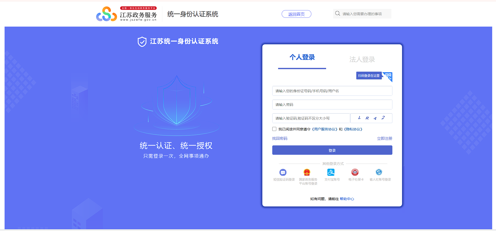

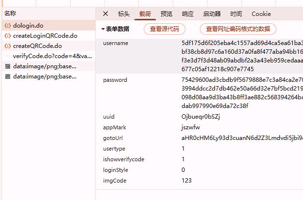

登陆时向

https://www.jszwfw.gov.cn/jsjis/front/dologin.do

发送表单请求

同时可以看到username与password进行了加密

## 参数解密

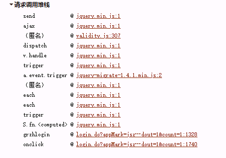

查看调用堆栈，很有意思的地方来了。

大多数都是jquery请求，这就表明了实际上的加密很简单。

断点到validity.js

```js
if (result == true && op.auto == true) {

    var submitBtn = $(form.find('[type=submit],.submit'));

    var data = form.serialize();

    submitBtn.attr('disabled', true).removeClass('btn-primary').addClass('disabled');

    if (op.type == 'ajax') {

        var url = form.attr('action');

        $.ajax({

            type: "post",

            url: url,

            data: data,

            dataType: op.resultType,

            contentType: op.contentType,

            success: function (obj) {

                submitBtn.attr('disabled', false).removeClass('disabled').addClass('btn-primary');

                op.success(obj);

            },

            error: function (a, b, msg) {

                submitBtn.attr('disabled', false).removeClass('disabled').addClass('btn-primary');

                alert('操作失败');

                op.error();

            }

        });

        result = false;

    }

}
```

看到请求构造中的data 直接采用了form表单中的数据，查看html元素

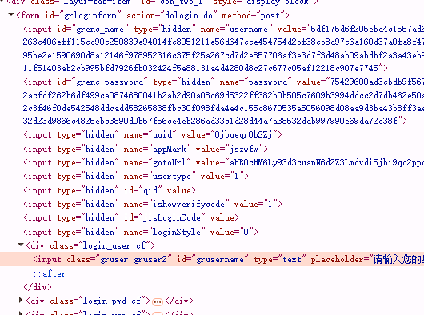

可以看到在上方有一个隐藏表单，其数据为加密后的数据

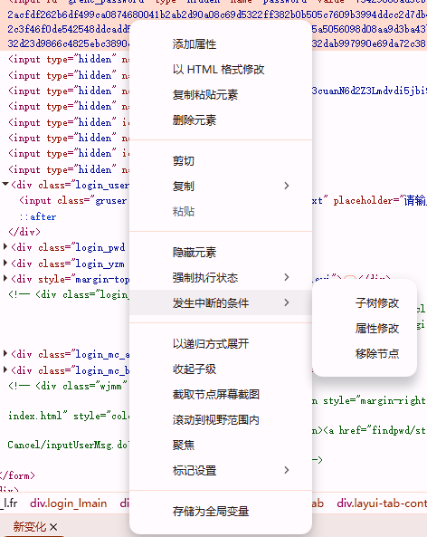

添加断点

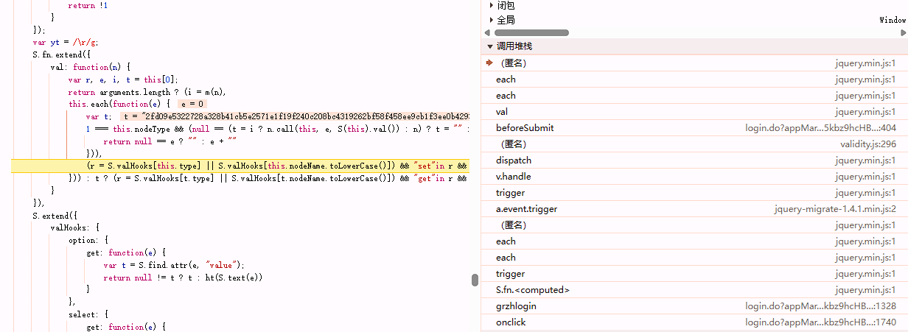

查看断点，发现调用堆栈大多数都是jquery，但仔细看会发现一个不在jquery域内的函数名，beforeSubmit。

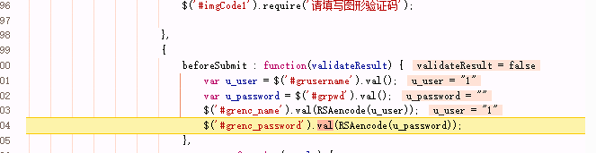

查看后就发现其使用RSA加密。

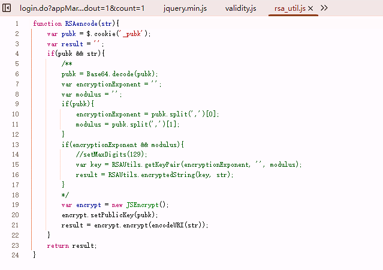

查看加密实现，发现其很简单，使用Cookie的pubk然后加密


那么我们在登陆时只需要加密参数然后登陆即可...


吗？

并非如此，接下来还有验证码这一关：

在请求登陆时，我们没有提交验证码本体信息，也就是服务器怎么知道我们看的是哪张验证码呢？

查看验证码的请求你会发现其是单独请求，并返回SERVERID，因此我们有理由怀疑验证码是通过Cookie进行鉴权的，如果不是那另寻他法吧，我并没有验证是否时由Cookie认证的，但是在我实际测试中带上Cookie是可以通过登陆的。

通过访问：
  
https://www.jszwfw.gov.cn/jsjis/component/verifyCode.do?code=4&var=rand&width=162&height=55&random=0.8959013298765615

然后存Cookie和图片即可

登陆后会返回什么呢？

```json
{
    "params": {
        "cornum": string,
        "certkey": number,
        "certKey":string,
        "ssourl": string,
        "corpType": string,
        "uuid": string,
        "returnMark": string,
        "returnSsoUrl":string,
        "creditCode":string,
        "idName": string,
        "id": string,
        "mark": string
    },
    "message": null,
    "code": null,
    "success": true
}
```

先不管这些，我们看返回后做了什么
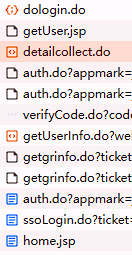

答案是发了一堆请求最后重定向到相关页面

由于在实际的实践中，鉴权Cookie字段为：  SESSION

所以我们查看其中set-Cookie中包含   SESSION 的请求

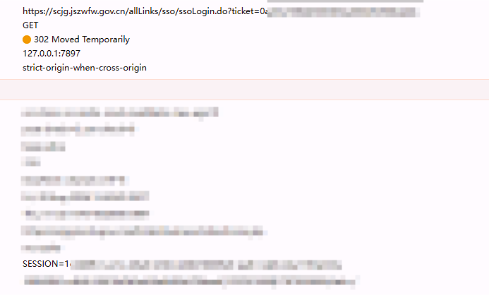

轻而易举的我们获得了这个请求。

向上溯源，我们可以发现其是由

auth.do重定向获得的

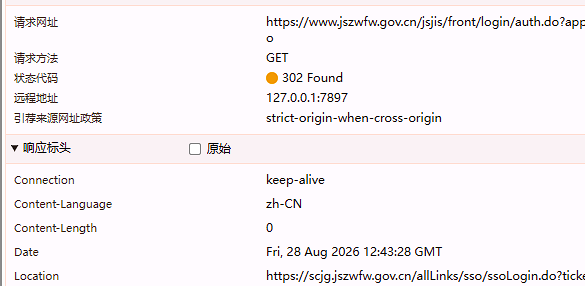

而auth.do是由谁发起的呢？

答案是没有人，因为请求参数中没有任何内容。由脚本自行发起，

那它是怎么鉴权的呢？

答案是smToken：

其在请求中携带smToken，由getgrinfo.do下发

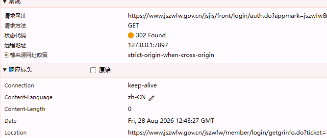

gergrinfo.do 的鉴权方式是cookie，但我没有仔细研究具体是哪个字段。

其请求也是自发请求的，在我们登陆主站后自动请求。

于是我们就可以写一个完整请求链：

```js
import { UserName, Password } from "./config.js";

import crypto from "node:crypto"

import fs from "fs"

import rl from "readline/promises"

import { stdin, stdout } from "node:process";

const publicKey = `-----BEGIN PUBLIC KEY-----

MIIBIjANBgkqhkiG9w0BAQEFAAOCAQ8AMIIBCgKCAQEAsimkvpK7zedhvhj1AwTA8948NBiiYTRhqoiwuaV8ZEwqDShtqO4xGS2lpaPXZQhwW8Vc8hjqgYlwRaqg5hzxNV2dxEOWSsaq5pFDTHalqvrh+FbWyweX763JwWaFuqiKjXa9Okcpz7BY5FZyb4H665a6lNIoA4CAmLHGhr+02JY2avpgLCZPXOyE913aSI5csqOQrusYq3o9u18ApEVkvoIaGWs3Wf3ONrxsD0SyVb8XD0chGTGblCinQH9oLw+L7PflSeLHbS6czDNpzWz3GZHiyHPNm9yNt5vfFT+lx618P/uwLqgPy3JDVv1ZbKLxye4/4lGqU5df4zh90kDY4QIDAQAB

-----END PUBLIC KEY-----`;

  
  

class CookieC {

    constructor() {

        this.Cookies = { _pubk: "MIIBIjANBgkqhkiG9w0BAQEFAAOCAQ8AMIIBCgKCAQEAsimkvpK7zedhvhj1AwTA8948NBiiYTRhqoiwuaV8ZEwqDShtqO4xGS2lpaPXZQhwW8Vc8hjqgYlwRaqg5hzxNV2dxEOWSsaq5pFDTHalqvrh+FbWyweX763JwWaFuqiKjXa9Okcpz7BY5FZyb4H665a6lNIoA4CAmLHGhr+02JY2avpgLCZPXOyE913aSI5csqOQrusYq3o9u18ApEVkvoIaGWs3Wf3ONrxsD0SyVb8XD0chGTGblCinQH9oLw+L7PflSeLHbS6czDNpzWz3GZHiyHPNm9yNt5vfFT+lx618P/uwLqgPy3JDVv1ZbKLxye4/4lGqU5df4zh90kDY4QIDAQAB" }

    }

    get() {

        return this.Cookies

    }

    set(Key, Val) {

        this.Cookies[Key] = Val

    }

    getCookie() {

        let Cookie = ""

        for (const [key, val] of Object.entries(this.Cookies)) {

            Cookie += `${key}=${val};`

        }

        return Cookie

    }

}

  

const C = new CookieC()

  

function GoCookie(Cookies) {

    for (let i = 0; i < Cookies.length; i++) {

        const str = Cookies[i].split(';')[0]

        const datas = str.split('=')

        C.set(datas[0], datas[1])

    }

}

async function GetImg() {

    const data = await fetch('https://www.jszwfw.gov.cn/jsjis/component/verifyCode.do?code=4&var=rand&width=162&height=55&random=0.30401052380726556', {

  

    })

    const cookies = data.headers.getSetCookie()

    GoCookie(cookies)

    const bf = await data.arrayBuffer()

    fs.writeFileSync('./code.png', Buffer.from(bf))

}

async function Login(pwd, unm) {

    GetImg()

    const username = crypto.publicEncrypt({

        key: publicKey,

        padding: crypto.constants.RSA_PKCS1_PADDING

    }, Buffer.from(unm)).toString('hex')

    const password = crypto.publicEncrypt({

        key: publicKey,

        padding: crypto.constants.RSA_PKCS1_PADDING

    }, Buffer.from(pwd)).toString('hex')

    const Data = new FormData()

    Data.append("username", username)

    Data.append("password", password)

    Data.append("uuid", "6SmkNXXmpPY4")

    Data.append("appMark", "jsscjdgljxt")

    Data.append("gotoUrl", "")

    Data.append("usertype", "1")

    Data.append("ishowverifycode", "1")

    Data.append("loginStyle", "0")

    const a = rl.createInterface({

        input: stdin,

        output: stdout,

    })

    const code = await a.question("输入验证码\n")

    Data.append("imgCode", code)

    const data = await fetch("https://www.jszwfw.gov.cn/jsjis/front/dologin.do", {

        method: "POST",

        headers: {

            "Cookie": C.getCookie()

        },

        body: Data

    })

    GoCookie(data.headers.getSetCookie())

    await GetSmToken()

    GetSESSION()

}

  

async function GetSESSION() {

    const data = await fetch("https://www.jszwfw.gov.cn/jsjis/front/login/auth.do?appmark=jsscjdgljxt&gotoUrl=&ssourl=https://scjg.jszwfw.gov.cn/allLinks/sso/ssoLogin.do",{

        method:"GET",

        redirect:"manual",

        headers:{

            "Cookie":C.getCookie()

        }

    })

    const url = data.headers.get('location')

    fetch(url, {

        method: "GET",

        redirect: "manual",

        headers: {

            "Cookie": C.getCookie()

        }

    }).then((d) => {

        console.log(d.headers.getSetCookie())

    })

}

  

async function GetSmToken() {

    const data = await fetch("https://www.jszwfw.gov.cn/jsjis/front/login/auth.do?appmark=jszwfw&ssourl=https://www.jszwfw.gov.cn/jszwfw/member/login/getgrinfo.do", {

        method: "GET",

        redirect: "manual",

        headers: {

            "Cookie": C.getCookie()

        }

    })

    GoCookie(data.headers.getSetCookie())

    fetch(data.headers.get('Location'), {

        method: "GET",

        redirect: "manual",

        headers: {

            "Cookie": C.getCookie()

        }

    }).then((d) => {

        GoCookie(d.headers.getSetCookie())

    })

}

  

Login(Password, UserName)
```

我在其请求中使用了Class CookieC进行cookie管理，登陆时只需传递明文账号密码至Login函数，然后控制台就会打印SESSION。

另外验证码在./code.png


# 后日谈

政务网加密几乎没有，另外我所登陆这个业务模块在几个月前从明文换成国密sm2了，但是还是明文好啊。

我仅作技术分享，不做任何违反法律的事情。帽子叔叔不要找我谢谢。

