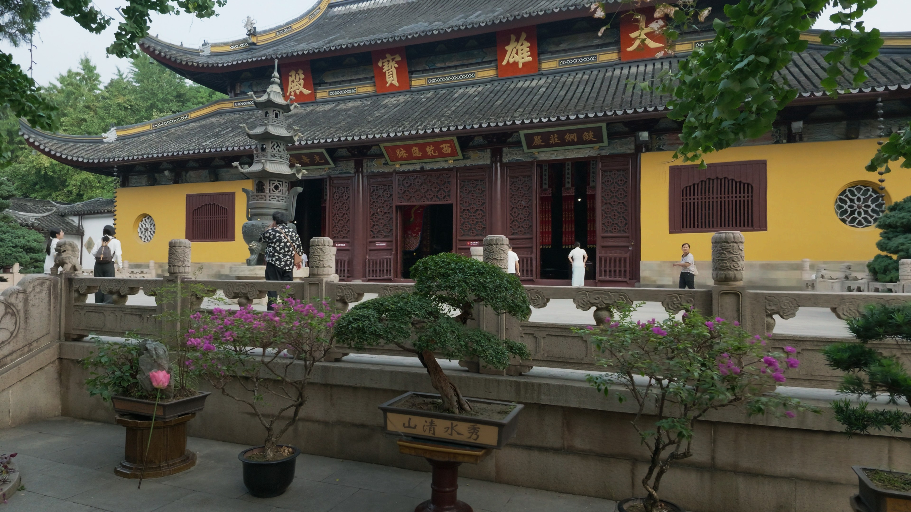
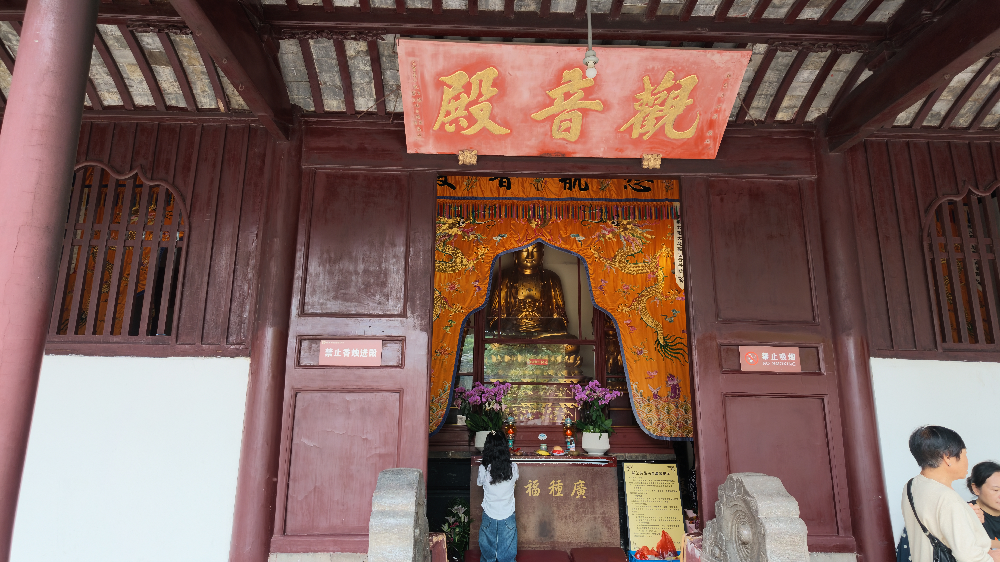
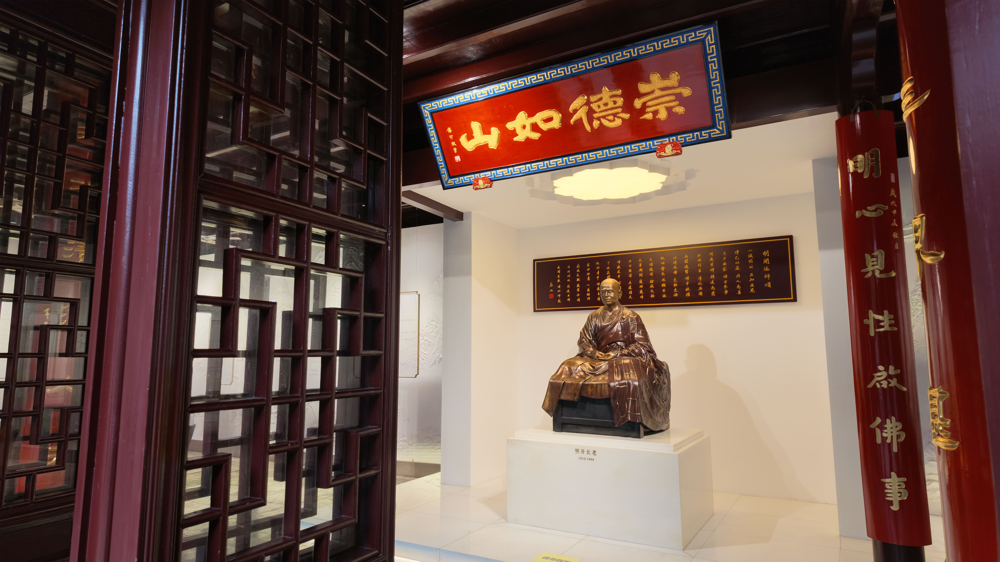
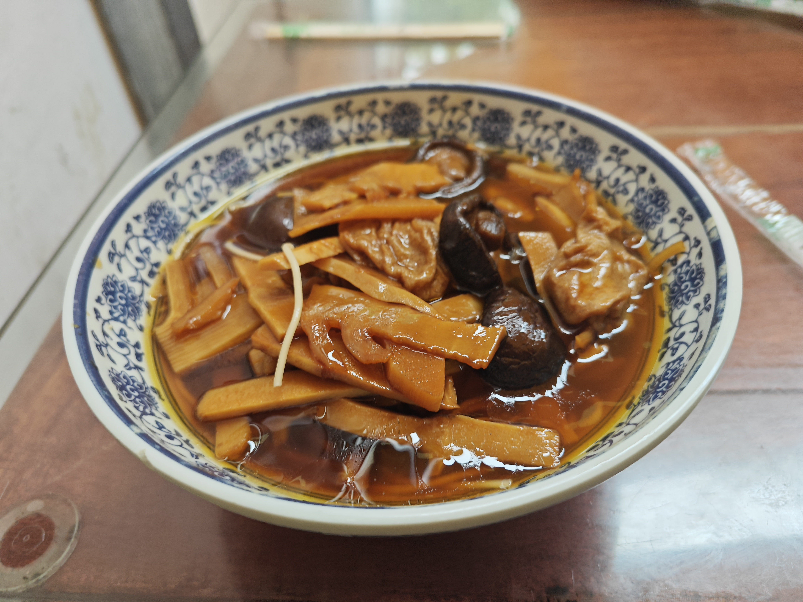

<iframe src="//player.bilibili.com/player.html?isOutside=true&aid=117343002822844&bvid=BV1hTaY6bEPo&cid=42250406578&p=1" scrolling="no" border="0" frameborder="no" framespacing="0" allowfullscreen="true"></iframe>

# 寺

寺，在现代已经慢慢的向大众开放。

也慢慢的失去其原有的意义了。

我不禁想去思考，现代又有多少人会选择出家呢？

# 佛

佛教，历史悠久。

我并不信仰任何宗教，但我理解，也尊重其相信宗教的人。

人在世，又怎得没有信仰呢？即使不信任任何宗教，也有自己的信仰与目标。

# 西园寺

隐坐与苏州，其与苏州园林相比，并不出名。

它不仅是传统意义上的寺庙，也拥有园林...与猫。

## 猫

猫是世界上最可爱的生物之一。可爱到有人愿意立法保护，但这并不在今天的主题中。

猫在寺内随处可见，走几步就会有一只。

它们就像生活在这里似的，即使是流浪而来。

当然，你也可以收养这些猫。

寺中的僧人也会每天给它们喂食。

## 寺

正如开头我所提到的，寺庙似乎正在慢慢的失去它原有的意义。

目前的含义转变为了求佛，参观。而并非进行宗教活动。

功德甚至也可以移动支付了，且加上了门票；不过这里指的一提的是，如果你是8:00前入园的，是可以免门票的。

我有时在想，拜佛；祈求；上香。似乎只是安慰罢了。

当然这只是我这个无神论者所想的，但人似乎有时就需要这些安慰，至少拥有了希望，也有了盼头。

但，为什么就会帮助你呢，平时并不供奉，而今专门来祈求...

而真正出家的，他们所信仰的是佛教，遵守的是戒律。

每天念经文，自我修身。佛是否真的存在已经不重要了，重要的是佛所代表的那种品格。

另外，此寺中拥有许多铜人像，也算比较震撼的，在开头视频有所展示。

## 食

寺内是拥有食物售卖的，其为包子和面。当然都是素的。

价格还算适中，素面（观音面）15￥，视频也有提及。 

说到食物和宗教，这里提及一下基督教。

小时候（大概不到10岁），奶奶带我去家附近的教堂，还记得当时在圣诞节前后（圣诞节在之前，我并没有实际去理解其含义，如今拆分看来，圣 诞生的节日，就是耶稣诞生的节日，其是拥有宗教含义的节日，而并非春节这种传统意义上的节日。）教堂中拥有小品表演，不过大多是宣传教义的。但中午是提供免费的饭的，好像是面条还是什么肉汤。

在最近，看到了一种说法，在河南一带我们说日期是礼拜几，而礼拜这个词本身也是拥有宗教意义的。只是在以前河南饥荒的时候，基督教会免费提供食物来救济，这就导致了这一带基督教偏多。

但不管是什么宗教，我都是理解和尊重的。我也会因为他们做的好事而感动。

# 终

好久没写这种日常的文章了，以后会更多的...

（这里本应有此次游玩所有素材，但我暂时鸽了）
