# 前言

:::warning
本文章只做技术交流，请勿用于任何非法用处，否则自行承担责任。
:::

在之前我写过一篇文章来解析此平台的请求...吗？

好像没有，但我写过一篇此平台登陆的内容，目前也应该更新了。

不过我要先把平台自身的加密给写出来，因为此次更新后加密变得复杂了。

# 正文

在我上一篇关于此平台的[文章](https://blog.3mua.cn/post/1787918567449/#%E5%8F%82%E6%95%B0%E8%A7%A3%E5%AF%86)中提到了 _“政务网加密几乎没有，另外我所登陆这个业务模块在几个月前从明文换成国密sm2了，但是还是明文好啊。”_ 这不过完国庆，平台大更新。

更新后前段界面变得更现代化了，在逆向的过程中能够看到是使用了Vue的，且后端与前段一同更改了接口内容。

这使得之前的接口参数与请求内容地址无法使用，不得不说在此之前，这个模块的加密几乎可以说没有，全部使用jQuery写的，代码根本没有混淆。
不过国庆后使用了更现代的Vue，也就使得难度变高了。

今天早上打开政务网发现界面变得那么新就觉得不对。那么话不多说先来看看变了什么吧。

哦对了，在开始之前我要补充一下背景，在更新之前，此业务模块的加密使用的是SM国密，其SM2+SM4混着使用，但仅作一层加密，也就是请求和解析的时候。

好了正式开始：

## 接口响应

任意发送一个后端请求，查看其响应体：

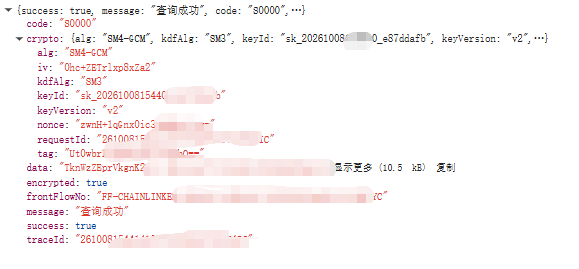

不难看出，我们想要的内容被放在`data`中被加密

其响应体中也有crypto的内容，其涉及SM4-GCM（加密方式）SM3（哈希计算）
但又有什么用呢，难道拿iv+我们请求的key就可以解析了吗？

我们的请求体：

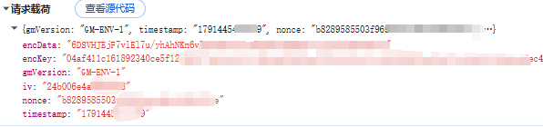

在更新前，确实是这样的。不过更新后虽然我们的请求体与之前没有变化，但是这样是行不通的了。

查看请求发送的启动器：

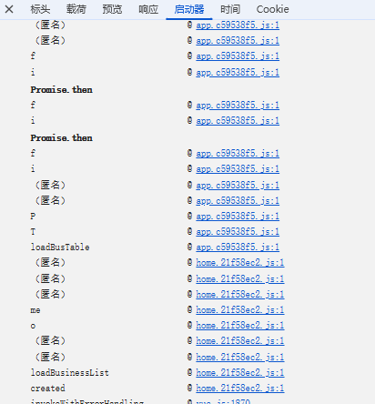

可以看到是打包构建后的产物，及其复杂，但是我们能看到其有个函数为`loadBusTable`与我们的接口名相同。

可以从此入手，打上断点看到

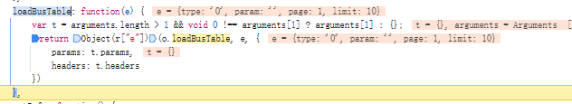

这是加密前的请求参数，与更新前的内容一模一样。拿顺着这条路线，按理来说我们可以根据断点一步一步的跳过去。直到看到加密函数...吗？

然而如果你真的这么做了，那么你将及其痛苦。因为我就是这样的。

由于此次引入了Vue的原因，你一步步执行要执行大多数Vue的内部方法。就算你真的跳出来了，你还需要一步步分析，因为打包构建后代码会简化许多，很多步骤并没有在运行中呈现而是一步到位的。

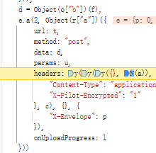

例如如果你正常来到了这一步，那么d的结果就不会在调试中显示，但你追踪来源的话是可以发现`d = Object(o["b"])(f),`,而f正是加密前的参数。

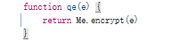

查看`o["b"]`这个函数，发现是一个加密函数的封装。

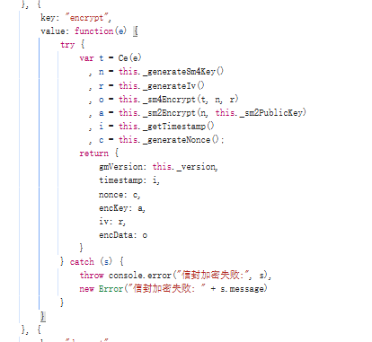

再向下看加密函数，这里解释一下`_generateSm4Key`类似的生成函数都是生成16位字符串的，时间函数除外。也就是参数都是本地随机生成的。

那么这时候你可能以为新版本的加密不过如此嘛。

我们先按下不表，来解析一下目前这个加密函数：

```js
function(e) {
  try {
    //这个Ce函数是JSON.Stringify
    var t = Ce(e),
      n = this._generateSm4Key(),
      r = this._generateIv(),
      o = this._sm4Encrypt(t, n, r),
      a = this._sm2Encrypt(n, this._sm2PublicKey),
      i = this._getTimestamp(),
      c = this._generateNonce();
    return {
      gmVersion: this._version,
      timestamp: i,
      nonce: c,
      encKey: a,
      iv: r,
      encData: o,
    };
  } catch (s) {
    throw (
      console.error("信封加密失败:", s),
      new Error("信封加密失败: " + s.message)
    );
  }
}
```

t n r分别为：请求体，SmKey，Iv 是加密需要的参数，通过sm4加密后作为data传出，而加密本身的秘钥Smkey需要再使用sm2加密后传出。

很简单对吧，但如果你真这么写你就会发现缺少请求参数。

然后你又仔细观察发现，新的请求中拥有了三个新的请求头：

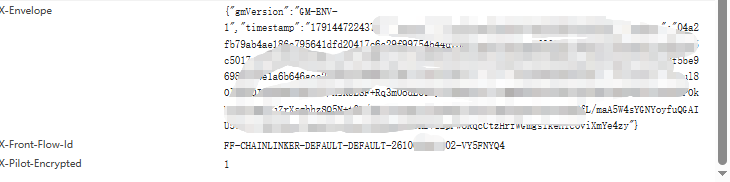

其中X-Envelope最为奇怪，但也是不可或缺的。

x-front-flow-id作为随机id出现，构成为：FF-CHAINLINKER-DEFAULT-DEFAULT-年月日时分秒-随机八位字符串，其中日期都为2位数，不足补0

来分析X-Envelope，观察会发现与我们请求体相似，但参数不同。

也就是我们在请求前还需要构建一个请求内容放在请求头中，那么我们构建什么呢？

得益于刚才我们发现了加密函数，我们只要对其进行分析即可：

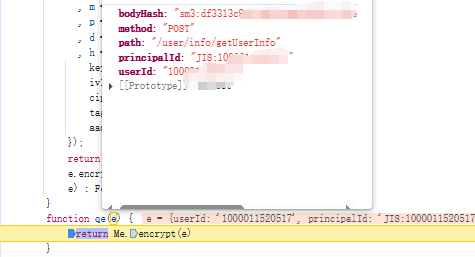

真正有意思的地方来了，我们需要构建一个图中类似的请求体，其请求参数包含UID，请求方法，请求路径，且带有Body的hash。

其他的都好说，Body的hash要怎么来求呢？

我可以很负责的告诉你，我追踪了半天没有追踪出来。但我们发现其使用sm3拼接而成，我们搜索sm3字符串：

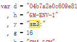

哇真的搜到了，其被赋值为y。然后我们搜索`y +`：

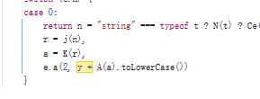

可以找到这一条，因为其直接返回而及其隐秘，所以无法定位。

打上断点后我们看A函数：

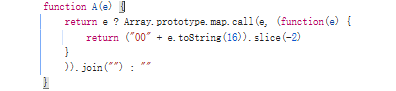

其作用为将byte转为16进制

那我们看a也是一个字节组，向上再看两个函数就能发现

```js
r = j(n),
a = K(r),
e.a(2, y + A(a).toLowerCase())
```
n传递进来的时候是请求体原内容，经过转换后变为字节组，查看j函数

```js
        function j(e) {
            if ("undefined" !== typeof TextEncoder)
                return (new TextEncoder).encode(e);
            for (var t = unescape(encodeURIComponent(e)), n = new Uint8Array(t.length), r = 0; r < t.length; r++)
                n[r] = t.charCodeAt(r);
            return n
        }
```
函数作用为将字符串转换为字节，那么查看K函数：

```js
        function K(e) {
            var t = new Uint32Array([1937774191, 1226093241, 388252375, 3666478592, 2842636476, 372324522, 3817729613, 2969243214])
              , n = e.length
              , r = 8 * n
              , o = (56 - (n + 1) % 64 + 64) % 64
              , a = n + 1 + o + 8
              , i = new Uint8Array(a);
            i.set(e, 0),
            i[n] = 128;
            var c = Math.floor(r / 4294967296)
              , s = r >>> 0;
            i[a - 8] = c >>> 24 & 255,
            i[a - 7] = c >>> 16 & 255,
            i[a - 6] = c >>> 8 & 255,
            i[a - 5] = 255 & c,
            i[a - 4] = s >>> 24 & 255,
            i[a - 3] = s >>> 16 & 255,
            i[a - 2] = s >>> 8 & 255,
            i[a - 1] = 255 & s;
            for (var u = new Uint32Array(t), l = 0; l < a; l += 64) {
                for (var f = new Uint32Array(68), m = new Uint32Array(64), p = 0; p < 16; p++) {
                    var d = l + 4 * p;
                    f[p] = (i[d] << 24 | i[d + 1] << 16 | i[d + 2] << 8 | i[d + 3]) >>> 0
                }
                for (var h = 16; h < 68; h++)
                    f[h] = (V(f[h - 16] ^ f[h - 9] ^ z(f[h - 3], 15)) ^ z(f[h - 13], 7) ^ f[h - 6]) >>> 0;
                for (var y = 0; y < 64; y++)
                    m[y] = (f[y] ^ f[y + 4]) >>> 0;
                for (var g = u[0], b = u[1], v = u[2], I = u[3], S = u[4], O = u[5], N = u[6], T = u[7], D = 0; D < 64; D++) {
                    var w = D <= 15 ? 2043430169 : 2055708042
                      , E = z((z(g, 12) + S >>> 0) + z(w, D % 32) >>> 0, 7)
                      , P = (E ^ z(g, 12)) >>> 0
                      , C = (Z(g, b, v, D) + I >>> 0) + P + m[D] >>> 0
                      , _ = (Y(S, O, N, D) + T >>> 0) + E + f[D] >>> 0;
                    I = v,
                    v = z(b, 9),
                    b = g,
                    g = C,
                    T = N,
                    N = z(O, 19),
                    O = S,
                    S = H(_)
                }
                u[0] = (u[0] ^ g) >>> 0,
                u[1] = (u[1] ^ b) >>> 0,
                u[2] = (u[2] ^ v) >>> 0,
                u[3] = (u[3] ^ I) >>> 0,
                u[4] = (u[4] ^ S) >>> 0,
                u[5] = (u[5] ^ O) >>> 0,
                u[6] = (u[6] ^ N) >>> 0,
                u[7] = (u[7] ^ T) >>> 0
            }
            for (var A = new Uint8Array(32), j = 0; j < 8; j++)
                A[4 * j] = u[j] >>> 24 & 255,
                A[4 * j + 1] = u[j] >>> 16 & 255,
                A[4 * j + 2] = u[j] >>> 8 & 255,
                A[4 * j + 3] = 255 & u[j];
            return A
        }
```
其内容为SM3哈希计算。

也就是说bodyhash其实就是请求参数的SM3内容

但如果这时你补齐了请求头而发送请求后，你还是会发现错误。

因为这里有一个坑在SM4加密中（我这都发现了）

查看之前的SM4加密函数：

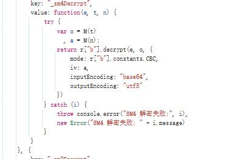

你会发现其使用了M函数对传入的 t n进行了二次计算

```js
        function M(e) {
            for (var t = "", n = 0; n < e.length; n++) {
                var r = e.charCodeAt(n)
                  , o = r.toString(16);
                t += ("0" + o).slice(-2)
            }
            return t
        }
```
其作用是把字符串每一个字节转换为16进制字符串。

如果你补齐这个函数进行加密，那么你会发现发送成功了。

接下来就是：

## 解密

因为太复杂了我就直接把解密函数贴出来吧：

```js
function Le(e) {
  if (!T(e)) return e;
  if (!e.encrypted) return e;
  var t = Ee();
  if (!t || N(t.sessionKey))
    return Fe(e, "sessionKey 缺失，请先调用 generateSessionKey() 生成会话密钥");
  var n = Ie(e);
  if (!n.found) return Fe(e, "提取密文失败：" + n.reason);
  var r = Pe(),
    o = n.keyId || (r && r.keyId) || "",
    //"v2"
    a = n.keyVersion || (r && r.keyVersion) || "",
    i = n.alg || (r && r.alg) || b,
    c = n.requestId || "",
    // U为hexToByte
    s = U(t.sessionKey),
    //B为解码
    u = B(n.nonce, "nonce"),
    l = B(n.iv, "iv"),
    f = B(n.encrypted, "cipherText"),
    m = B(n.tag, "tag"),
    //这里需要 sessionkey "v2" 响应体的keyID 响应体的requestId,nonce的bytes
    p = ge(s, a, o, c, u.bytes),
    // keyversion("v2"),keyID,requestid,noncebytes,ivbytes,alg
    d = be(a, o, c, u.bytes, l.bytes, i),
    h = ve({
      keyInfo: p,
      ivInfo: l,
      cipherInfo: f,
      tagInfo: m,
      aadInfo: d,
    });
  return h.success
    ? ((e.data = h.plainJson), (e.encrypted = !1), e)
    : Fe(e, h.warning);
}
```
注意备注都是我自己加的，我们可以看到ve计算前使用了p作为key，l作为iv，f作为内容，m作为tag，而d作为额外内容

那么p从哪里来呢？

```js
function ge(e, t, n, r, o) {
  //g是16，这里在做长度校验
  if (!e || e.length !== g)
    throw new Error("派生 responseKey 失败：sessionKey 必须为 16 字节");
  if (N(t)) throw new Error("派生 responseKey 失败：keyVersion 不能为空");
  if (N(n)) throw new Error("派生 responseKey 失败：keyId 不能为空");
  if (N(r)) throw new Error("派生 responseKey 失败：requestId 不能为空");
  if (!o || 0 === o.length)
    throw new Error("派生 responseKey 失败：nonce 不能为空");

  //L函数是将字符串转换为bytes,G是将这些内容按照顺序合并一个[]bytes
  var a = G(e, L(t), L(n), L(r), o),
    //K函数是SM3哈希算法
    i = K(a),
    //截断16位
    c = i.slice(0, g);
  return {
    bytes: c,
    //bytesToHEX
    hex: A(c),
  };
}
```
是来自这个函数，我备注的应该很易懂了吧。

那么d从哪里来呢？

```js
function be(e, t, n, r, o, a) {
  var i = F(r),
    c = F(o),
    s =
      String(e) +
      "|" +
      String(t) +
      "|" +
      String(n) +
      "|" +
      i +
      "|" +
      c +
      "|" +
      String(a || b),
    u = L(s);
  return {
    bytes: u,
    sourceText: s,
  };
}
```
从这里来，结合上方备注可以看出来，就是字符串拼接转bytes。

以上就是所有内容了，不到一天就可以破解，下面就会研究登陆内容了。

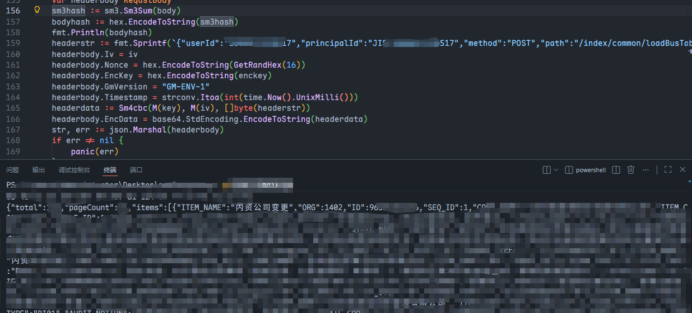

Go复现